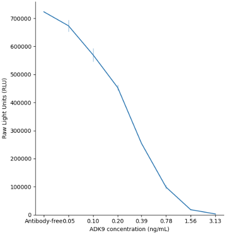

## Running the Tutorials

Before running the tutorials, activate the `uv` virtual environment:

**macOS/Linux**

```bash
source uv/bin/activate
```
**Windows (PowerShell)**
```
.\uv\Scripts\Activate.ps1
```

The tutorial walks through:

## 1. Loading and plotting a neutralization curve
```bash
cd tutorials # Navigate to the Tutorials directory if you cloned the repository
python 1_show_plate_and_curve.py
```

### Example Output


## 2. Creating dose-response curves with Hill equation fitting
```bash
python 2_show_nd50.py
```
### Example Output


## 3. Calculating ND50 values using multiple methods
```bash
python 3_compare_curves.py
```


## 4. Running the Bayesian Equivalence Test to compare two samples
```bash
python 3_compare_curves.py
```
Output after script completed should end with:
```
...
ND50 for MOI10 = 1/16.4, ND50 for MOI100 = 1/26.4
Difference in ND50 between MOI10 and MOI100 is significantly larger than 0.3 log2 units.
```


